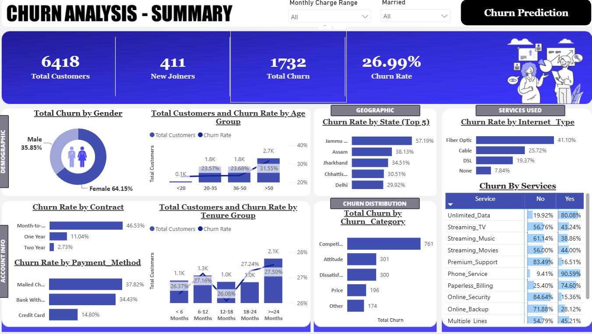
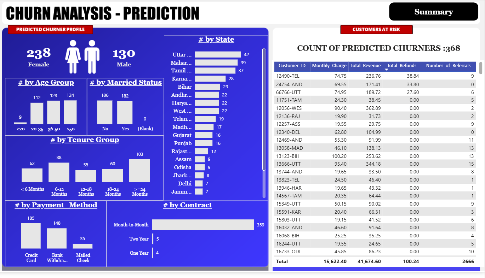

# Customer Churn Analysis & Prediction

This project focuses on analyzing customer churn and understanding the factors that may lead to customer loss.

I used SQL, Python, Machine Learning, and Power BI to clean the data, perform analysis, build a churn prediction model, and create an interactive dashboard.

## Tools Used

- SQL Server
- Python
- Scikit-learn
- Power BI

## Project Steps

1. Data Cleaning and Analysis using SQL
2. Data Exploration and Visualization using Python
3. Data Preprocessing and Feature Encoding
4. Churn Prediction using Random Forest
5. Customer Churn Analysis and Dashboard in Power BI

## Power BI Dashboard

### Churn Analysis - Summary

### Churn Analysis - Prediction

## Key Results

- Total Customers: 6,418
- Total Churn: 1,732
- Churn Rate: 26.99%
- Predicted Churners: 368

The dashboard helps in understanding churn based on customer demographics, contract, payment method, tenure, internet type, services, and state.

    └── README.md
